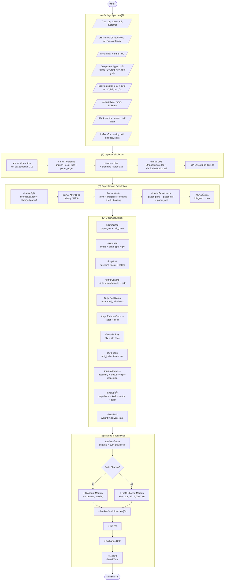
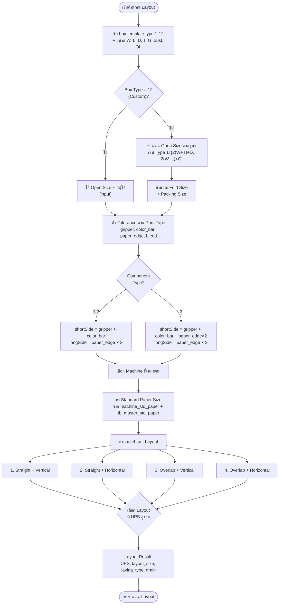
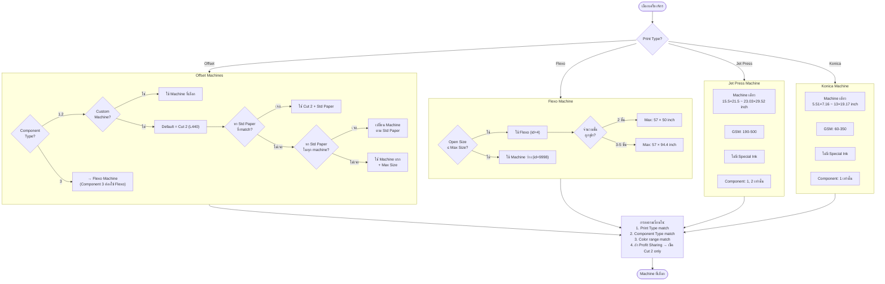
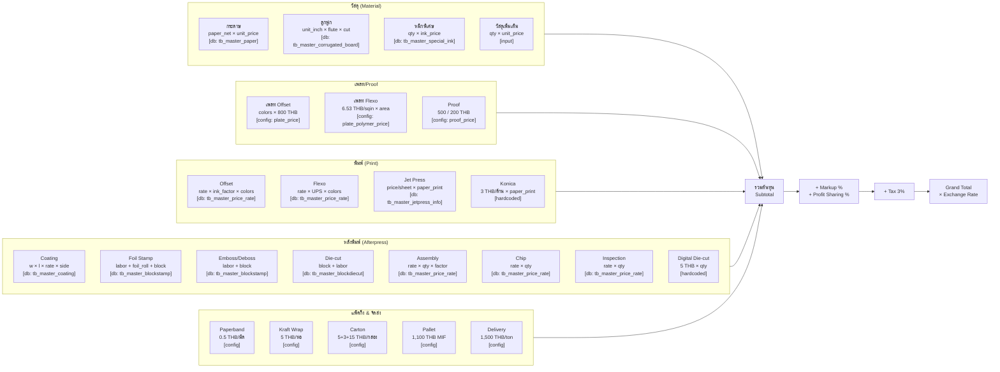
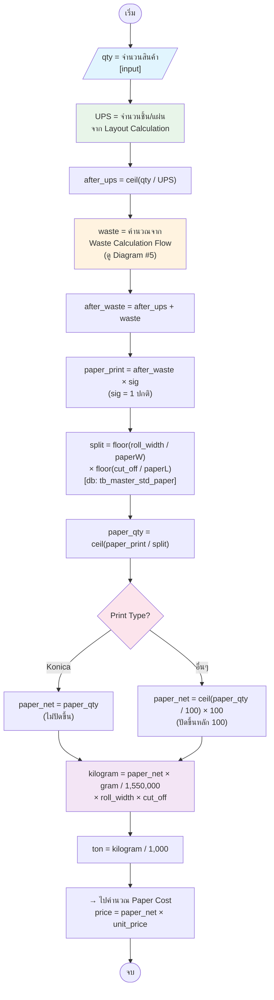
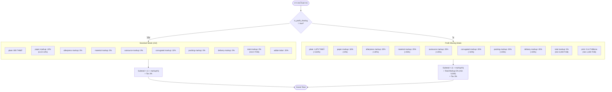

# Diagrams ระบบ Estimate Packaging (Mermaid)

> **เอกสารนี้** รวม Mermaid diagrams ทั้งหมด 7 รายการ
> เปิดดูได้ใน GitHub, VS Code (Markdown Preview Enhanced), หรือ https://mermaid.live

---

## 1. Main Calculation Pipeline (ภาพรวมการคำนวณทั้งหมด)

---

## 2. Layout Calculation Flow (การคำนวณ Layout)

---

## 3. Machine Selection Logic (เงื่อนไขเลือกเครื่องจักร)

---

## 4. Cost Calculation Breakdown (รายละเอียดต้นทุน)

---

## 5. Waste Calculation Flow (การคำนวณเศษสูญเสีย)

```mermaid
flowchart TD
    START([เริ่มคำนวณ Waste]) --> QTY

    QTY["after_ups = ceil(qty / UPS)"]
    QTY --> LOOKUP

    LOOKUP["ค้นหา waste rate จาก database\nตาม print_type + qty range\n[db: tb_master_waste]"]
    LOOKUP --> TYPES

    subgraph TYPES["คำนวณ Waste แต่ละประเภท"]
        W1["waste_print\nถ้า rate < 1 → ceil(after_ups × rate)\nมิฉะนั้น → ใช้ rate ตรงๆ"]
        W2["waste_afterpress\nจาก afterpress_rate"]
        W3["waste_coating\nจาก coating_rate × จำนวนด้าน"]
        W4["waste_foilstamp\nจาก foilstamp_rate"]
        W5["waste_bossing\nจาก bossing_rate"]
        W6["waste_corrugated_board\nจาก corrugated_board_rate"]
        W7["waste_print_col_add\nจาก print_col_add_rate\nสำหรับสี > 4"]
    end

    TYPES --> CL

    CL{"ใช้ Color Limit?"}
    CL -->|ใช่| CL_Y["waste_color_limit =\nwaste(300) + (colors-4) × per_color(50)"]
    CL -->|ไม่| CL_N["waste_color_limit = 0"]

    CL_Y --> REDUCE
    CL_N --> REDUCE

    REDUCE{"Waste Reduction\n(Jet Press 30%, Konica 30%)"}
    REDUCE --> RED_CALC["สำหรับแต่ละ waste type:\nreduce = ceil(waste × reduce%/100)\nwaste = waste - reduce"]

    RED_CALC --> SUM

    subgraph SUM["รวม Waste ทั้งหมด"]
        S1["+ waste_print\n(Jet Press/Konica: คิดแยก outside/inside)"]
        S2["+ waste_color_limit"]
        S3["+ waste_afterpress + waste_afterpress_net"]
        S4["+ waste_print_col_add × (all_colors - 4)\nเฉพาะ Offset/Flexo ที่สี > 4"]
        S5["+ waste_coating × จำนวนด้าน\nต่อ coating ที่เลือก"]
        S6["+ waste_foilstamp\nต่อ foilstamp ที่เลือก"]
        S7["+ waste_bossing\nต่อ emboss/deboss ที่เลือก"]
    end

    SUM --> TOTAL["Total Waste = sum of all"]
    TOTAL --> END([จบคำนวณ Waste])
```

---

## 6. Paper Usage Flow (การคำนวณปริมาณกระดาษ)

---

## 7. Profit Sharing vs Standard Pricing (เปรียบเทียบ 2 โหมด)

---

## ดัชนี Diagram

| # | ชื่อ Diagram | วัตถุประสงค์ |
|---|------------|-----------|
| 1 | Main Calculation Pipeline | ภาพรวม flow ทั้งหมดตั้งแต่ input ถึง output |
| 2 | Layout Calculation Flow | ขั้นตอนคำนวณ layout: open size → tolerance → machine → UPS |
| 3 | Machine Selection Logic | เงื่อนไขเลือกเครื่องจักรตาม print type, component, สี |
| 4 | Cost Calculation Breakdown | รายละเอียดต้นทุนทุกรายการ + แหล่งข้อมูล |
| 5 | Waste Calculation Flow | การคำนวณ waste แต่ละประเภท + reduction |
| 6 | Paper Usage Flow | ขั้นตอน qty → after_ups → waste → paper_net → tons |
| 7 | Profit Sharing vs Standard | เปรียบเทียบ markup rates ระหว่าง 2 โหมด |
